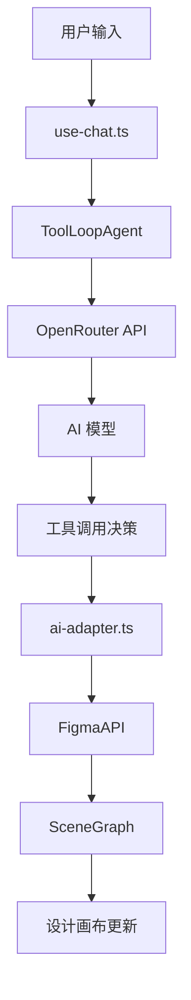
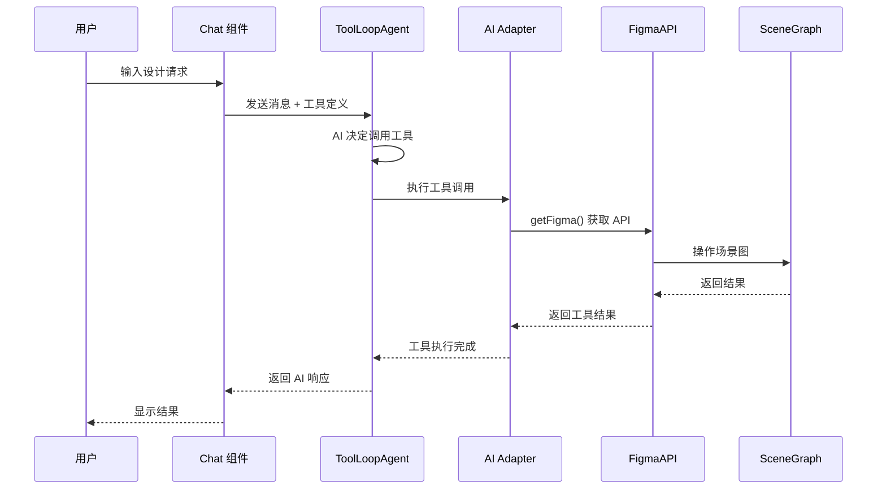
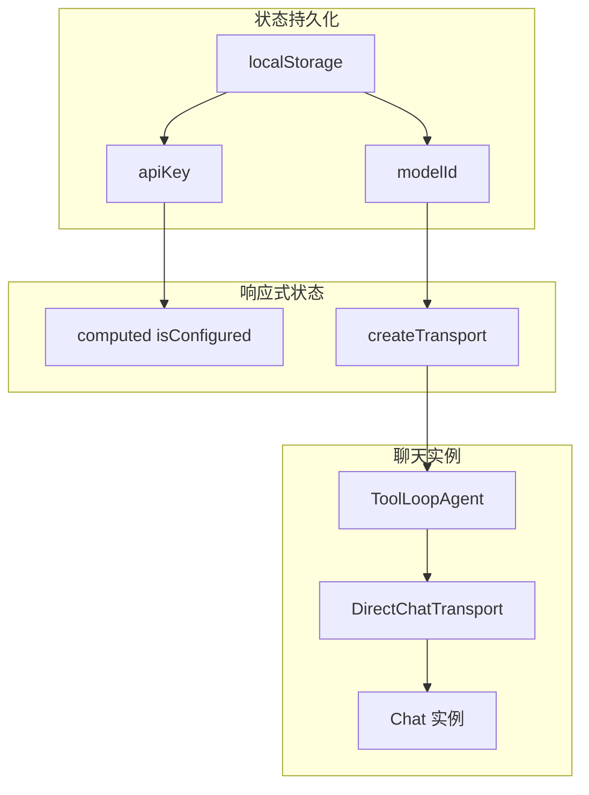
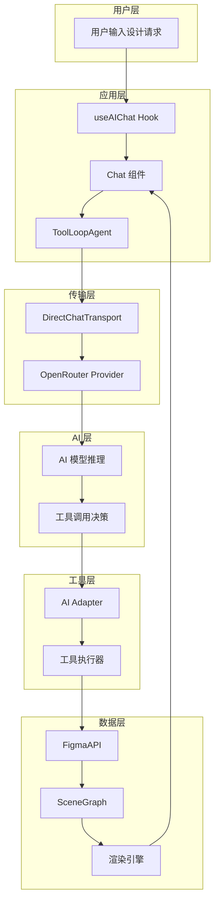

# OpenPencil AI 处理逻辑分析文档

## 概述

OpenPencil 是一个类似 Figma 的设计编辑器，集成了 AI 辅助功能。本文档详细分析了项目中 AI 处理的完整逻辑，包括提示词设计、工具调用机制和代码架构。

---

## 架构总览



---

## 一、核心文件结构

| 文件路径 | 功能描述 |
|---------|---------|
| `src/composables/use-chat.ts` | AI 聊天会话管理、提示词定义 |
| `src/ai/tools.ts` | AI 工具创建入口 |
| `packages/core/src/tools/ai-adapter.ts` | 工具定义到 Vercel AI SDK 适配器 |
| `packages/core/src/tools/schema.ts` | 所有设计工具的定义 |
| `packages/core/src/constants.ts` | AI 模型配置列表 |
| `packages/core/src/figma-api.ts` | Figma 风格的 API 封装 |
| `packages/mcp/src/server.ts` | MCP 协议服务器 |

---

## 二、系统提示词分析

### 2.1 核心系统提示词

**文件位置**: `src/composables/use-chat.ts:19-30`

```typescript
const SYSTEM_PROMPT = dedent`
  You are a design assistant inside OpenPencil, a Figma-like design editor.
  Help users create and modify designs. Be concise and direct.
  When describing changes, use specific design terminology.

  Available node types: FRAME (containers/cards), RECTANGLE, ELLIPSE, TEXT, LINE, STAR, POLYGON, SECTION.
  Colors can be hex strings (#ff0000) or RGBA objects with values 0–1.
  Coordinates use canvas space — (0, 0) is the top-left of the page.

  Always use tools to make changes. After creating nodes, briefly describe what you did.
  When the user asks to create a layout, use create_shape with FRAME, then set_layout for auto-layout.
`
```

### 2.2 提示词设计要点

| 要点 | 说明 |
|-----|------|
| **角色定位** | 设计助手，在 OpenPencil 设计编辑器内工作 |
| **行为准则** | 简洁直接，使用专业设计术语 |
| **节点类型** | FRAME、RECTANGLE、ELLIPSE、TEXT、LINE、STAR、POLYGON、SECTION |
| **颜色格式** | 十六进制字符串 (#ff0000) 或 RGBA 对象 (0-1 范围) |
| **坐标系统** | 画布坐标系，原点在页面左上角 |
| **工具使用** | 必须通过工具进行更改，创建后简要描述操作 |

---

## 三、AI 模型配置

### 3.1 支持的模型列表

**文件位置**: `packages/core/src/constants.ts:88-122`

| 模型 ID | 名称 | 提供商 | 特点标签 |
|--------|------|-------|---------|
| `anthropic/claude-sonnet-4.6` | Claude Sonnet 4.6 | Anthropic | Best for design |
| `anthropic/claude-opus-4.6` | Claude Opus 4.6 | Anthropic | Smartest |
| `moonshotai/kimi-k2.5` | Kimi K2.5 | Moonshot | Vision + code |
| `google/gemini-3.1-pro-preview` | Gemini 3.1 Pro | Google | 1M context |
| `openai/gpt-5.3-codex` | GPT-5.3 Codex | OpenAI | - |
| `google/gemini-3-flash-preview` | Gemini 3 Flash | Google | Fast |
| `deepseek/deepseek-v3.2` | DeepSeek V3.2 | DeepSeek | Cheap |
| `qwen/qwen3-coder:free` | Qwen3 Coder | Qwen | Free |

### 3.2 模型选择逻辑

```typescript
// 默认使用 Claude Sonnet 4.6
export const DEFAULT_AI_MODEL = AI_MODELS[0].id

// 用户选择存储在 localStorage
const modelId = ref(localStorage.getItem(MODEL_STORAGE) ?? DEFAULT_AI_MODEL)
```

---

## 四、工具调用机制

### 4.1 工具定义结构

**文件位置**: `packages/core/src/tools/schema.ts`

```typescript
export interface ToolDef {
  name: string           // 工具名称
  description: string    // 工具描述
  params: Record<string, ParamDef>  // 参数定义
  execute: (figma: FigmaAPI, args: Record<string, any>) => unknown  // 执行函数
}

export interface ParamDef {
  type: ParamType        // 参数类型: string | number | boolean | color | string[]
  description: string    // 参数描述
  required?: boolean     // 是否必需
  default?: unknown      // 默认值
  enum?: string[]        // 枚举值
  min?: number           // 最小值
  max?: number           // 最大值
}
```

### 4.2 参数类型映射

| ParamType | Valibot Schema | 说明 |
|-----------|---------------|------|
| `string` | `v.string()` 或 `v.picklist()` | 字符串，支持枚举 |
| `number` | `v.number()` + min/max 约束 | 数值类型 |
| `boolean` | `v.boolean()` | 布尔类型 |
| `color` | `v.string()` + description | 颜色值（十六进制） |
| `string[]` | `v.array(v.string())` | 字符串数组 |

### 4.3 AI 适配器实现

**文件位置**: `packages/core/src/tools/ai-adapter.ts`

```typescript
export function toolsToAI(
  tools: ToolDef[],
  options: AIAdapterOptions,
  deps: { v, valibotSchema, tool }
): Record<string, any> {
  const result: Record<string, any> = {}

  for (const def of tools) {
    // 1. 构建参数 Schema
    const shape: Record<string, unknown> = {}
    for (const [key, param] of Object.entries(def.params)) {
      shape[key] = paramToValibot(v, param)
    }

    // 2. 创建 Vercel AI SDK 工具
    result[def.name] = tool({
      description: def.description,
      inputSchema: valibotSchema(v.object(shape)),
      execute: async (args: Record<string, unknown>) => {
        options.onBeforeExecute?.()
        try {
          // 3. 调用工具执行函数
          return await def.execute(options.getFigma(), args)
        } finally {
          options.onAfterExecute?.()
        }
      }
    })
  }

  return result
}
```

### 4.4 工具调用流程



---

## 五、聊天会话管理

### 5.1 use-chat.ts 核心逻辑

**文件位置**: `src/composables/use-chat.ts`

```typescript
// 存储键
const API_KEY_STORAGE = 'open-pencil:openrouter-api-key'
const MODEL_STORAGE = 'open-pencil:model'

// 响应式状态
const apiKey = ref(localStorage.getItem(API_KEY_STORAGE) ?? '')
const modelId = ref(localStorage.getItem(MODEL_STORAGE) ?? DEFAULT_AI_MODEL)

// 创建传输层
function createTransport() {
  // 1. 初始化 OpenRouter
  const openrouter = createOpenRouter({
    apiKey: apiKey.value,
    headers: {
      'X-OpenRouter-Title': 'OpenPencil',
      'HTTP-Referer': 'https://github.com/open-pencil/open-pencil'
    }
  })

  // 2. 创建 AI 工具
  const tools = createAITools(useEditorStore())

  // 3. 创建 Agent
  const agent = new ToolLoopAgent({
    model: openrouter(modelId.value),
    instructions: SYSTEM_PROMPT,
    tools
  })

  // 4. 返回传输层
  return new DirectChatTransport({ agent })
}
```

### 5.2 状态管理



---

## 六、FigmaAPI 封装

### 6.1 API 类结构

**文件位置**: `packages/core/src/figma-api.ts`

```typescript
export class FigmaAPI {
  readonly graph: SceneGraph           // 场景图引用
  private _currentPageId: string       // 当前页面 ID
  private _selection: FigmaNodeProxy[] // 当前选择
  private _nodeCache = new Map<string, FigmaNodeProxy>()  // 节点缓存

  // 节点创建方法
  createFrame(): FigmaNodeProxy
  createRectangle(): FigmaNodeProxy
  createEllipse(): FigmaNodeProxy
  createText(): FigmaNodeProxy
  createLine(): FigmaNodeProxy
  createPolygon(): FigmaNodeProxy
  createStar(): FigmaNodeProxy
  createVector(): FigmaNodeProxy
  createComponent(): FigmaNodeProxy
  createSection(): FigmaNodeProxy

  // 节点操作
  getNodeById(id: string): FigmaNodeProxy | null
  group(nodes: FigmaNodeProxy[], parent: FigmaNodeProxy): FigmaNodeProxy
  ungroup(node: FigmaNodeProxy): void

  // 变量系统
  createVariable(name: string, type: VariableType, collectionId: string): Variable
  getVariableById(id: string): Variable | null
}
```

### 6.2 FigmaNodeProxy 属性

| 属性类别 | 属性名 | 类型 |
|---------|-------|------|
| **基础** | id, type, name, removed | string, NodeType, string, boolean |
| **几何** | x, y, width, height, rotation | number |
| **视觉** | fills, strokes, effects, opacity | Array, Array, Array, number |
| **圆角** | cornerRadius, topLeftRadius, ... | number |
| **文本** | characters, fontSize, fontName, ... | string, number, object |
| **布局** | layoutMode, itemSpacing, padding*, ... | string, number |
| **约束** | constraints, minWidth, maxWidth, ... | object, number |
| **树结构** | parent, children | FigmaNodeProxy, Array |

---

## 七、MCP 协议服务器

### 7.1 MCP 服务器功能

**文件位置**: `packages/mcp/src/server.ts`

MCP (Model Context Protocol) 服务器提供了标准化的 AI 接口，使外部 AI 工具能够调用 OpenPencil 功能。

### 7.2 核心工具

| 工具名 | 描述 | 参数 |
|-------|------|------|
| `open_file` | 打开 .fig 文件 | path: string |
| `save_file` | 保存当前文档 | path: string |
| `new_document` | 创建新文档 | 无 |

### 7.3 参数转换 (ParamDef → Zod)

```typescript
function paramToZod(param: ParamDef): z.ZodTypeAny {
  const typeMap: Record<ParamType, () => z.ZodTypeAny> = {
    string: () => param.enum
      ? z.enum(param.enum as [string, ...string[]]).describe(param.description)
      : z.string().describe(param.description),
    number: () => {
      let s = z.number()
      if (param.min !== undefined) s = s.min(param.min)
      if (param.max !== undefined) s = s.max(param.max)
      return s.describe(param.description)
    },
    boolean: () => z.boolean().describe(param.description),
    color: () => z.string().describe(param.description),
    'string[]': () => z.array(z.string()).min(1).describe(param.description)
  }
  const schema = typeMap[param.type]()
  return param.required ? schema : schema.optional()
}
```

---

## 八、设计工具清单

### 8.1 形状创建工具

| 工具名 | 描述 | 主要参数 |
|-------|------|---------|
| `create_shape` | 创建形状节点 | type, x, y, width, height, name |
| `create_text` | 创建文本节点 | x, y, text, fontSize, fontFamily |

### 8.2 布局工具

| 工具名 | 描述 | 主要参数 |
|-------|------|---------|
| `set_layout` | 设置自动布局 | nodeId, mode, itemSpacing, padding* |
| `set_constraints` | 设置约束 | nodeId, horizontal, vertical |

### 8.3 样式工具

| 工具名 | 描述 | 主要参数 |
|-------|------|---------|
| `set_fill` | 设置填充 | nodeId, color, opacity |
| `set_stroke` | 设置描边 | nodeId, color, width, align |
| `set_corner_radius` | 设置圆角 | nodeId, radius |
| `set_effect` | 设置效果 | nodeId, type, color, offset, blur |

### 8.4 变换工具

| 工具名 | 描述 | 主要参数 |
|-------|------|---------|
| `move_node` | 移动节点 | nodeId, x, y |
| `resize_node` | 调整大小 | nodeId, width, height |
| `rotate_node` | 旋转节点 | nodeId, rotation |

### 8.5 文本工具

| 工具名 | 描述 | 主要参数 |
|-------|------|---------|
| `set_text_content` | 设置文本内容 | nodeId, text |
| `set_text_style` | 设置文本样式 | nodeId, fontSize, fontWeight, textAlign |

---

## 九、数据流分析

### 9.1 完整请求流程



### 9.2 工具执行上下文

```typescript
// 工具执行时的上下文构建
export function createAITools(store: EditorStore) {
  return toolsToAI(
    ALL_TOOLS,
    {
      // 获取 Figma API 实例
      getFigma: () => {
        const api = new FigmaAPI(store.graph)
        api.currentPage = api.wrapNode(store.state.currentPageId)
        api.currentPage.selection = [...store.state.selectedIds]
          .map((id) => api.getNodeById(id))
          .filter((n): n is NonNullable<typeof n> => n !== null)
        return api
      },
      // 执行后触发渲染
      onAfterExecute: () => {
        store.requestRender()
      }
    },
    { v, valibotSchema, tool }
  )
}
```

---

## 十、关键技术点

### 10.1 工具调用模式

OpenPencil 采用 **Vercel AI SDK** 的工具调用模式：

1. **定义阶段**: 使用 `defineTool()` 定义工具结构
2. **适配阶段**: 使用 `toolsToAI()` 转换为 AI SDK 格式
3. **执行阶段**: AI 决定调用工具后，通过 `FigmaAPI` 执行

### 10.2 多模型支持

通过 OpenRouter 实现多模型统一接入：

- 统一的 API 密钥管理
- 统一的请求/响应格式
- 灵活的模型切换

### 10.3 实时渲染同步

```typescript
// 工具执行后自动触发渲染
onAfterExecute: () => {
  store.requestRender()
}
```

### 10.4 状态持久化

- API Key: `open-pencil:openrouter-api-key`
- 模型选择: `open-pencil:model`

---

## 十一、类比理解

### 11.1 建筑师与施工队类比

| OpenPencil 组件 | 建筑施工类比 |
|----------------|------------|
| 用户 | 业主（提出设计需求） |
| 系统提示词 | 建筑规范和设计指南 |
| AI 模型 | 建筑师（理解需求、绘制蓝图） |
| 工具定义 | 施工工具清单（锤子、尺子等） |
| FigmaAPI | 施工队（执行具体操作） |
| SceneGraph | 建筑结构图（数据模型） |
| 渲染引擎 | 施工现场展示 |

### 11.2 翻译官类比

AI 在这个系统中扮演"翻译官"的角色：
- 将用户的自然语言描述"翻译"成工具调用
- 将工具执行结果"翻译"成用户可理解的反馈

---

## 十二、总结

OpenPencil 的 AI 处理系统是一个精心设计的多层架构：

1. **提示词层**: 定义 AI 的角色和行为准则
2. **模型层**: 通过 OpenRouter 支持多种 AI 模型
3. **工具层**: 统一的工具定义和适配机制
4. **API 层**: Figma 风格的 API 封装
5. **数据层**: SceneGraph 场景图管理

这种分层设计使得：
- AI 模型可以轻松切换
- 工具可以灵活扩展
- UI 和数据逻辑解耦
- 支持 MCP 协议集成外部工具

---

## 参考资料

- [Vercel AI SDK 文档](https://sdk.vercel.ai/docs)
- [OpenRouter API 文档](https://openrouter.ai/docs)
- [Model Context Protocol 规范](https://modelcontextprotocol.io)
- [Valibot 验证库](https://valibot.dev)
- [Figma Plugin API](https://www.figma.com/plugin-docs/)
